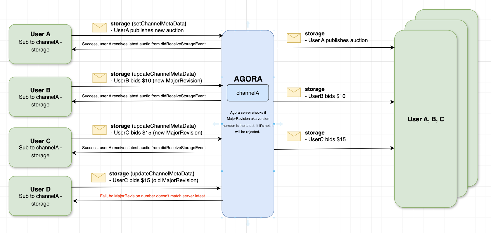

<a name="readme-top"></a>


### Architecture




<p align="right">(<a href="#readme-top">back to top</a>)</p>


<!-- USAGE EXAMPLES -->
## Usage

This sample showcase how to use the `.storage` feature to publish and receive an auction update. Unlike the `.presence` data, the `.storage` data is stored permanently even if all users logouts. There are types of `.storage`: channel metadata and user metadata. This sample uses the channel metadata type to store and update an auction. With the `majorRevisionProperty`property, we can enable version control to ensure that everyone see the same auction value. 
 

| Subscribe features | Description |
| --- | --- |
| `.storage` | Callback to receive channelmeta or user usermeta data  |


<!-- Sample Code -->
## Sample Code

**Initialize the Agora RTM SDK**
```swift
// Initialize the Agora RTM SDK
let config = AgoraRtmClientConfig(appId: "your_app_id" , userId: "user_id")
var agoraRtmKit: AgoraRtmClientKit = try AgoraRtmClientKit(config, delegate: self)
```

**Login to Agora Server**
```swift
// Login to Agora Server
if let (response, error) = await agoraRtmKit?.login("user_token") {
    if error == nil{
       // Login successful
    }else{
      // Login failed
    }
} else {
    // Login failed
}
```

**Subscribe to a Channel**
```swift
// Define the subscription feature
let subOptions: AgoraRtmSubscribeOptions = AgoraRtmSubscribeOptions()
subOptions.features =  [.message, .presence]

// Subscribe to a channel  
if let (response, error) = await agoraRtmKit?.subscribe(channelName: channelName, option: subOptions){
    if error == nil{
       // Subscribe successful
    }else{
      // Subscribe failed
    }
}
```

**Set Channel Metadata (aka User placed a new auction)**
```swift
guard let metaData: AgoraRtmMetadata = agoraRtmKit?.getStorage()?.createMetadata() else { return false }

let metaDataItem: AgoraRtmMetadataItem = AgoraRtmMetadataItem()
metaDataItem.key = "auctionName"
metaDataItem.value = auctionName

let metaDataItem2: AgoraRtmMetadataItem = AgoraRtmMetadataItem()
metaDataItem2.key = "startingPrice"
metaDataItem2.value = String(startingPrice)

let metaDataItem3: AgoraRtmMetadataItem = AgoraRtmMetadataItem()
metaDataItem3.key = "currentBid"
metaDataItem3.value = String(startingPrice)

let metaDataItem4: AgoraRtmMetadataItem = AgoraRtmMetadataItem()
metaDataItem4.key = "highestBidder"
metaDataItem4.value = userID

let metaDataItem5: AgoraRtmMetadataItem = AgoraRtmMetadataItem()
metaDataItem5.key = "lastUpdatedTimeStamp"
metaDataItem5.value = String(Date().timeIntervalSince1970)

// Update the metadata item
metaData.setMetadataItem(metaDataItem)
metaData.setMetadataItem(metaDataItem3)
metaData.setMetadataItem(metaDataItem4)
metaData.setMetadataItem(metaDataItem5)

// Fetch the majorrevision value 
let majorRevision = await fetchMajorRevision() // You can use the agoraRtmKit?.getStorage()?.getChannelMetadata
metaData.setMajorRevision(majorRevision)

// Metadata options
let metaDataOption: AgoraRtmMetadataOptions = AgoraRtmMetadataOptions()
metaDataOption.recordUserId = true
metaDataOption.recordTs = true

if let (_, error) = await agoraRtmKit?.getStorage()?.setChannelMetadata(channelName: mainChannel, channelType: .message, data: metaData, options: metaDataOption, lock: nil) {
    if error == nil {
        // Set successful

    }else { 
        // Set failed
    }
}

```

**Updating the Channel Metadata (aka user placed a higher bid)**
```swift
// First create a metadata object
guard let metaData: AgoraRtmMetadata = agoraRtmKit?.getStorage()?.createMetadata() else { return }

let metaDataItem: AgoraRtmMetadataItem = AgoraRtmMetadataItem()
metaDataItem.key = "auctionName"
metaDataItem.value = currentAuctionItem.auctionName

let metaDataItem3: AgoraRtmMetadataItem = AgoraRtmMetadataItem()
metaDataItem3.key = "currentBid"
metaDataItem3.value = String(price)

let metaDataItem4: AgoraRtmMetadataItem = AgoraRtmMetadataItem()
metaDataItem4.key = "highestBidder"
metaDataItem4.value = userID

let metaDataItem5: AgoraRtmMetadataItem = AgoraRtmMetadataItem()
metaDataItem5.key = "lastUpdatedTimeStamp"
metaDataItem5.value = String(Date().timeIntervalSince1970)

// Update the metadata item
metaData.setMetadataItem(metaDataItem)
metaData.setMetadataItem(metaDataItem3)
metaData.setMetadataItem(metaDataItem4)
metaData.setMetadataItem(metaDataItem5)

// Set the major revision value
metaData.setMajorRevision(currentMajorRevisionValue) // **If the value is not the latest, the update will fail

// Metadata options
let metaDataOption: AgoraRtmMetadataOptions = AgoraRtmMetadataOptions()
metaDataOption.recordUserId = true
metaDataOption.recordTs = true

if let (response, error) = await agoraRtmKit?.getStorage()?.updateChannelMetadata(channelName: mainChannel, channelType: .message, data: metaData, options: metaDataOption, lock: nil){
    if error == nil {
        // Update successful
    }else { 
        // Update failed
    }
}
```

**Delete Channel metadata (aka delete an auction)**
```swift
guard let metaData: AgoraRtmMetadata = agoraRtmKit?.getStorage()?.createMetadata() else { return false }
metaData.setMajorRevision(currentMajorRevisionValue) // If the value is not the latest, the removal will fail

if let (response, error) = await agoraRtmKit?.getStorage()?.removeChannelMetadata(channelName: mainChannel, channelType: .message, data: metaData, options: nil, lock: nil) {
    if error == nil {
        // Removal success
    }else {
        // Removal failed
    }
}
```

**Logout RTM**
```swift
// Logout RTM server
func logoutRTM(){
    agoraRtmKit?.logout()
    agoraRtmKit?.destroy()
}
```

**Setup RTM Callbacks**
```swift
    // Receive storage event
    func rtmKit(_ rtmKit: AgoraRtmClientKit, didReceiveStorageEvent event: AgoraRtmStorageEvent) {
        if event.storageType == .channel {
            // Channel Metadata is updated. this callback will be triggered even if local user updated it        
            if event.eventType == .snapshot ||  event.eventType == .update || event.eventType == .set {
                // snapshot: when user joins, they will get a snapshop data of channelMeta data
                // update: metadata is updated e.g. user placed new bid 
                // set: metadata is set e.g. user placed a new bid
            }
        }
    }
    
    // Receive lock event (this sample )
    func rtmKit(_ rtmKit: AgoraRtmClientKit, didReceiveLockEvent event: AgoraRtmLockEvent) {
    }

```


<!-- NOTE-->
## NOTE

- The `.storage` metadata is permanently stored in our database. If you don't delete it, it will remain in our database. The channelMetadata is tied to a channel, and userMetadata is tied to a user. 


<p align="right">(<a href="#readme-top">back to top</a>)</p>


<!-- RTM API Limitation -->
## References

- API Reference (https://docs.agora.io/en/signaling/reference/api?platform=ios)
- Pricing (https://docs.agora.io/en/signaling/overview/pricing?platform=ios)
- API Limitations (https://docs.agora.io/en/signaling/reference/limitations?platform=android)


<p align="right">(<a href="#readme-top">back to top</a>)</p>


<!-- LICENSE -->
## License

Distributed under the MIT License. See `LICENSE.txt` for more information.

<p align="right">(<a href="#readme-top">back to top</a>)</p>


<!-- CONTACT -->
## Contact

Bac Huang  - bac@boldbright.studio

Project Link: [https://github.com/Bac1314/APIExample_AgoraRTM2x](https://github.com/Bac1314/APIExample_AgoraRTM2x)

<p align="right">(<a href="#readme-top">back to top</a>)</p>


