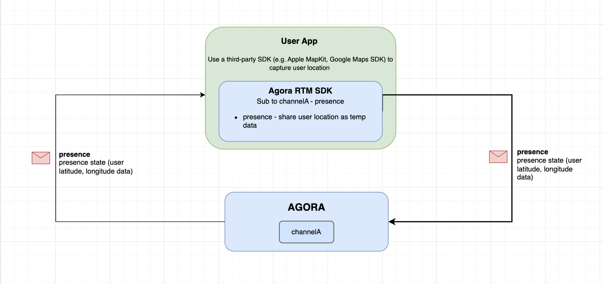

<a name="readme-top"></a>


### Architecture




<p align="right">(<a href="#readme-top">back to top</a>)</p>


<!-- USAGE EXAMPLES -->
## Usage

This sample showcase how to use the `.presence` feature to realize a real-time location sharing application. We use the Apple's MapKit framework to capture the user location (latitude and longitude). After we obtained the user location, we can `.presence` to temporary store and publish this location data to other subscribers. 
 

| Subscribe features | Description |
| --- | --- |
| `.presence` | Callback to receive user's states (online/offline, and user location)  |


<!-- Sample Code -->
## Sample Code

**Initialize the Agora RTM SDK**
```swift
// Initialize the Agora RTM SDK
let config = AgoraRtmClientConfig(appId: "your_app_id" , userId: "user_id")
var agoraRtmKit: AgoraRtmClientKit = try AgoraRtmClientKit(config, delegate: self)
```

**Login to Agora Server**

```swift
// Login to Agora Server 
if let (response, error) = await agoraRtmKit?.login("user_token") {
    if error == nil{
       // Login successful
    }else{
      // Login failed
    }
} else {
    // Login failed
}
```

**Subscribe to a Channel**
```swift
// Define the subscription feature
let subOptions: AgoraRtmSubscribeOptions = AgoraRtmSubscribeOptions()
subOptions.features =  [.presence]

// Subscribe to a channel  
if let (response, error) = await agoraRtmKit?.subscribe(channelName: channelName, option: subOptions){
    if error == nil{
       // Subscribe successful
    }else{
      // Subscribe failed
    }
}
```

**Setup third-party tool to acquire user location in realtime (e.g. Apple's MapKit)**
```swift
// Location properties
import MapKit

let locationManager : CLLocationManager = CLLocationManager()
let locationSpan = MKCoordinateSpan(latitudeDelta: 0.1, longitudeDelta: 0.1)
let latitudeKey = "latitude"
let longitudeKey = "longitude"

// Setup MapKit CLLocationManager
locationManager.delegate = self
locationManager.desiredAccuracy = kCLLocationAccuracyBest
locationManager.requestWhenInUseAuthorization()
locationManager.startUpdatingLocation()

// Setup the CLLLocationManager Delegate to receive the user location 
extension yourownclass: CLLocationManagerDelegate {
    // Authorization change
    func locationManagerDidChangeAuthorization(_ manager: CLLocationManager) {
    }

    // Location failed error
    func locationManager(_ manager: CLLocationManager, didFailWithError error: Error) {
    }

    // User location will be reported here
    func locationManager(_ manager: CLLocationManager, didUpdateLocations locations: [CLLocation]) {
        locations.last.map {
            let localRegion = MKCoordinateRegion(
                center: $0.coordinate,
                span: locationSpan
            )
            print("Bac's didUpdateLocations latitude \(localRegion.center.latitude) longitude \(localRegion.center.longitude) ")

            // Publish user location to other subscribers
            publishLocalLocation(newLocation: localRegion) // See below
        }
    } 

}

```

**Publish user location to other subscribers using the .presence data**
```swift
// Publish local user location
func publishLocalLocation(newLocation: MKCoordinateRegion) async {
    // Update the local users locally e.g. 
    currentUser.userLocation = newLocation
    
    // User presence AgoraRtmStateItem to store and publish user location
    let itemLatitude = AgoraRtmStateItem()
    itemLatitude.key = latitudeKey
    itemLatitude.value = String(newLocation.center.latitude) 
    
    let itemLongitude = AgoraRtmStateItem()
    itemLongitude.key = longitudeKey
    itemLongitude.value = String(newLocation.center.longitude)
    
    // Publish the user location to others 
    if let (response, error) = await agoraRtmKit?.getPresence()?.setState(channelName: mainChannel, channelType: .message, items: [itemLatitude, itemLongitude]){
        if error == nil {
            // Publish successful
        }else { 
            // Publish failed
        }
    }
}

```

**Setup RTM Callbacks - Receive remote users location**
```swift
// Receive presence event notifications in subscribed message channels and joined stream channels.
func rtmKit(_ rtmKit: AgoraRtmClientKit, didReceivePresenceEvent event: AgoraRtmPresenceEvent) {

    if event.type == .remoteLeaveChannel || event.type == .remoteConnectionTimeout {
    // A remote user left the channel
        
    }else if event.type == .remoteJoinChannel && event.publisher != nil {
     // A remote user subscribe the channel
        
    }else if event.type == .snapshot {
    // Get a snapshot of all the subscribed users' including 'presence' data when the user first joined)

        for remoteUser in event.snapshot {
        // Update remote location
            if let latitude =  remoteUser.states.first(where: {$0.key == latitudeKey})?.value, let longitude = remoteUser.states.first(where: {$0.key == longitudeKey})?.value{
                var publisher = remoteUser.userId
                let newLocation = MKCoordinateRegion(center: CLLocationCoordinate2D(latitude: Double(latitude) ?? 0.0, longitude: Double(longitude) ?? 0.0), span: locationSpan)
                print("Remote user \(publisher) latitude \(latitude) longitude \(longitude) ")
                // Add new user to list
                // ...

            }
        }
        
    }else if event.type == .remoteStateChanged {
        // A remote user's 'presence' data was changed (aka remote user updated their location)
        // Update remote location
        if let latitude =  event.states.first(where: {$0.key == latitudeKey})?.value, 
            let longitude = event.states.first(where: {$0.key == longitudeKey})?.value, 
            let publisher = event.publisher {
            let newLocation = MKCoordinateRegion(center: CLLocationCoordinate2D(latitude: Double(latitude) ?? 0.0, longitude: Double(longitude) ?? 0.0), span: locationSpan)
            // Update remote user location 
            //....
        
        }
    }
    
}

```


**Logout RTM**
```swift
// Logout RTM server
func logoutRTM(){
    agoraRtmKit?.logout()
    agoraRtmKit?.destroy()
}
```


<!-- NOTE-->
## NOTE

- The `.presence` states data are only temporary stored. Once the user logout of Agora RTM server, the data will be lost.  


<p align="right">(<a href="#readme-top">back to top</a>)</p>


<!-- RTM API Limitation -->
## References

- API Reference (https://docs.agora.io/en/signaling/reference/api?platform=ios)
- Pricing (https://docs.agora.io/en/signaling/overview/pricing?platform=ios)
- API Limitations (https://docs.agora.io/en/signaling/reference/limitations?platform=android)


<p align="right">(<a href="#readme-top">back to top</a>)</p>


<!-- LICENSE -->
## License

Distributed under the MIT License. See `LICENSE.txt` for more information.

<p align="right">(<a href="#readme-top">back to top</a>)</p>


<!-- CONTACT -->
## Contact

Bac Huang  - bac@boldbright.studio

Project Link: [https://github.com/Bac1314/APIExample_AgoraRTM2x](https://github.com/Bac1314/APIExample_AgoraRTM2x)

<p align="right">(<a href="#readme-top">back to top</a>)</p>


