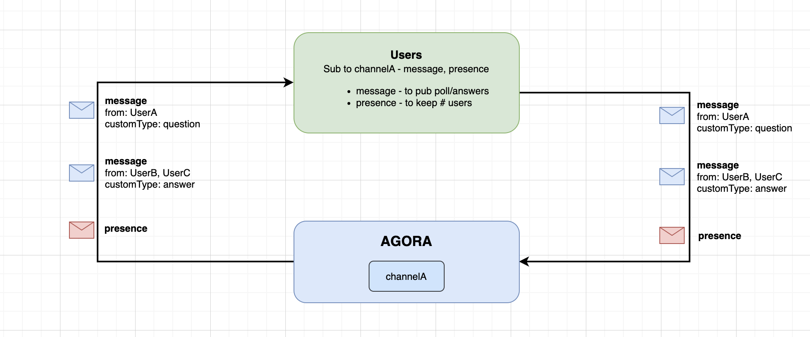

<a name="readme-top"></a>


### Architecture




<p align="right">(<a href="#readme-top">back to top</a>)</p>


<!-- USAGE EXAMPLES -->
## Usage

This sample showcases how to create a real-time polling solution with Agora RTM SDK.  The user will have the define their own question and options.

| Subscribe features | Description |
| --- | --- |
| `.message` | Callback to receive all messages of a subscribed channel (poll question and poll options) |
| `.presence` | Callback to get the users states (e.g join/leave/userstates) of a channel |


<!-- Sample Code -->
## Sample Code

**Initialize the Agora RTM SDK**
```swift
// Initialize the Agora RTM SDK
let config = AgoraRtmClientConfig(appId: "your_app_id" , userId: "user_id")
var agoraRtmKit: AgoraRtmClientKit = try AgoraRtmClientKit(config, delegate: self)
```

**Login to Agora Server**
```swift
// Login to Agora Server
if let (response, error) = await agoraRtmKit?.login("user_token") {
    if error == nil{
       // Login successful
    }else{
      // Login failed
    }
} else {
    // Login failed
}
```

**Subscribe to a Channel**
```swift
// Define the subscription feature
let subOptions: AgoraRtmSubscribeOptions = AgoraRtmSubscribeOptions()
subOptions.features =  [.message, .presence]

// Subscribe to a channel  
if let (response, error) = await agoraRtmKit?.subscribe(channelName: channelName, option: subOptions){
    if error == nil{
       // Subscribe successful
    }else{
      // Subscribe failed
    }
}
```

**Publish a Message (Poll Question)**
```swift
// Define the publish options
let pubOptions = AgoraRtmPublishOptions()
pubOptions.channelType = .message
pubOptions.customType = "PollQuestion"

// Publish message to a channel  
if let (response, error) = await agoraRtmKit?.publish(channelName: channelName, message: pollQuestionJSONString, option: pubOptions){
    if error == nil {
        // Publish successful
    }else{
        // Publish failed
    }
    
}
```

**Publish a Message (Poll Answer)**
```swift
// Define the publish options
let pubOptions = AgoraRtmPublishOptions()
pubOptions.channelType = .message
pubOptions.customType = "PollAnswer"

// Publish message to a channel  
if let (response, error) = await agoraRtmKit?.publish(channelName: channelName, message: pollAnswer, option: pubOptions){
    if error == nil {
        // Publish successful
    }else{
        // Publish failed
    }
    
}
```

**Logout RTM**
```swift
// Logout RTM server
func logoutRTM(){
    agoraRtmKit?.logout()
    agoraRtmKit?.destroy()
}
```

**Setup RTM Callbacks**
```swift
// Receive 'message' event notifications in subscribed message channels and subscribed topics.
func rtmKit(_ rtmKit: AgoraRtmClientKit, didReceiveMessageEvent event: AgoraRtmMessageEvent) {
    switch event.channelType {
    case .message:
        print("Received msg = \(event.message.stringData ?? "Empty") from \(event.publisher)")
        if event.customType == "PollQuestion" { 
            // Setup poll question UI
        }else if event.customType == "PollAnswer" { 
            // Remote user answered, update poll UI e.g. numberSubmissions += 1 
        }
        break
    case .stream:
        break
    case .user:
        break
    case .none:
        break
    @unknown default:
    }
}

// Receive 'presence' event notifications in subscribed message channels and joined stream channels.
func rtmKit(_ rtmKit: AgoraRtmClientKit, didReceivePresenceEvent event: AgoraRtmPresenceEvent) {

    if event.type == .remoteLeaveChannel || event.type == .remoteConnectionTimeout {
    // A remote user left the channel
        
    }else if event.type == .remoteJoinChannel && event.publisher != nil {
     // A remote user subscribe the channel
        
    }else if event.type == .snapshot {
    // Get a snapshot of all the subscribed users' including 'presence' data (aka temporary key-value pairs storage)
        
    }else if event.type == .remoteStateChanged {
    // A remote user's 'presence' data was changed
    }
}
```


<!-- RTM API Limitation -->
## References

- API Reference (https://docs.agora.io/en/signaling/reference/api?platform=ios)
- Pricing (https://docs.agora.io/en/signaling/overview/pricing?platform=ios)
- API Limitations (https://docs.agora.io/en/signaling/reference/limitations?platform=android)
- Security/Compliance (https://docs.agora.io/en/signaling/reference/security?platform=android) 


<p align="right">(<a href="#readme-top">back to top</a>)</p>


<!-- Note -->
## Note
- This sample is using a customType property to differentiate whether an incoming message is a poll question or poll answer. 
    - (Alternativel) You could also subscribe to 2 channels. 1 to publish the poll question, and 1 to receive the poll answers. 
    - (Alternative 2) You could also use the `.presence` to update publish the answer
- This sample is designed where every user will receive everyone's poll answer in real-time. This is helpful if you want to display the score or number of submissions in real-time. The number of messages (aka cost) increases **exponentially** the more users in the channel. 
    - (Alternative) You could design a solution where only the publisher receives the poll answers from the user. After certain time, the host can send the poll result back to the users. The number of messages (aka cost) increases **linearly**. 
    - (Alternative 2) You could design a solution where Linux Server (Agora Linux SDK) to manage all the answers and send back the poll result back to the users after a certain time.  **linearly**. 


<!-- LICENSE -->
## License

Distributed under the MIT License. See `LICENSE.txt` for more information.

<p align="right">(<a href="#readme-top">back to top</a>)</p>


<!-- CONTACT -->
## Contact

Bac Huang  - bac@boldbright.studio

Project Link: [https://github.com/Bac1314/APIExample_AgoraRTM2x](https://github.com/Bac1314/APIExample_AgoraRTM2x)

<p align="right">(<a href="#readme-top">back to top</a>)</p>


