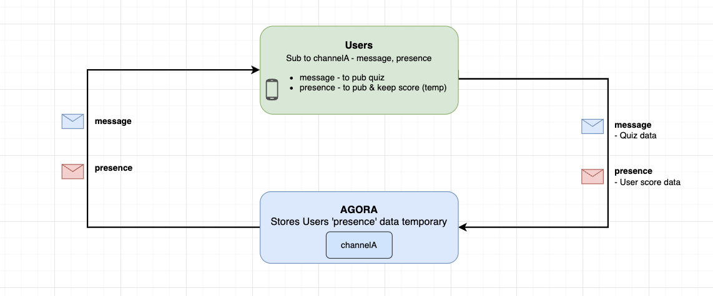

<a name="readme-top"></a>


### Architecture




<p align="right">(<a href="#readme-top">back to top</a>)</p>


<!-- USAGE EXAMPLES -->
## Usage

This sample showcases how to create a real-time Quiz game solution with Agora RTM SDK. It already comes with a list of quizzes, so users don't have to define their own. Once a user logins, there is an option to generate a new quiz. The `.message` is used for publishing the quiz question to all users, while the `.presence` is used for keeping the users score. 

| Subscribe features | Description |
| --- | --- |
| `.message` | Callback to receive all messages of a subscribed channel |
| `.presence` | Callback to get the users states (e.g join/leave/userstates) and saving quiz score |


<!-- Sample Code -->
## Sample Code

**Initialize the Agora RTM SDK**
```swift
// Initialize the Agora RTM SDK
let config = AgoraRtmClientConfig(appId: "your_app_id" , userId: "user_id")
var agoraRtmKit: AgoraRtmClientKit = try AgoraRtmClientKit(config, delegate: self)
```

**Login to Agora Server**
```swift
// Login to Agora Server
if let (response, error) = await agoraRtmKit?.login("user_token") {
    if error == nil{
       // Login successful
    }else{
      // Login failed
    }
} else {
    // Login failed
}
```

**Subscribe to a Channel**
```swift
// Define the subscription feature
let subOptions: AgoraRtmSubscribeOptions = AgoraRtmSubscribeOptions()
subOptions.features =  [.message, .presence]

// Subscribe to a channel  
if let (response, error) = await agoraRtmKit?.subscribe(channelName: channelName, option: subOptions){
    if error == nil{
       // Subscribe successful
    }else{
      // Subscribe failed
    }
}
```

**Publish a Message (Quiz question and answer)**
```swift
// Define the publish options
let pubOptions = AgoraRtmPublishOptions()
pubOptions.channelType = .message

// Publish message to a channel  
if let (response, error) = await agoraRtmKit?.publish(channelName: channelName, message: quizJSONString, option: pubOptions){
    if error == nil {
        // Publish successful
    }else{
        // Publish failed
    }
    
}
```

**Publish presence state update (User New Score)**
```swift
    // Define the user store in a AgoraRtmStateItem
    let item = AgoraRtmStateItem()
    item.key = "scoreKey"
    item.value = String(newScore)  // assuming you already processed the score somewhere else
    
    // Send the score to remote users
    if let (_, error) = await agoraRtmKit?.getPresence()?.setState(channelName: "channelName", channelType: .message, items: [item]){
        if error == nil {
            // Set state successful
        }else{
            // Set state failed
        }
    }
```

**Manually fetch user states (aka User user)**
```swift
    if let (response, error) = await agoraRtmKit?.getPresence()?.getState(channelName: channelName, channelType: .message, userId: userID) {
        return response?.state.states ?? []
    }
```


**Logout RTM**
```swift
// Logout RTM server
func logoutRTM(){
    agoraRtmKit?.logout()
    agoraRtmKit?.destroy()
}
```

**Setup RTM Callbacks**
```swift
// Receive 'message' event notifications in subscribed message channels and subscribed topics.
func rtmKit(_ rtmKit: AgoraRtmClientKit, didReceiveMessageEvent event: AgoraRtmMessageEvent) {
    switch event.channelType {
    case .message:
        print("Received msg = \(event.message.stringData ?? "Empty") from \(event.publisher)")
        // Received a new quiz
        break
    case .stream:
        break
    case .user:
        break
    case .none:
        break
    @unknown default:
    }
}

// Receive 'presence' event notifications in subscribed message channels and joined stream channels.
func rtmKit(_ rtmKit: AgoraRtmClientKit, didReceivePresenceEvent event: AgoraRtmPresenceEvent) {

    if event.type == .remoteLeaveChannel || event.type == .remoteConnectionTimeout {
    // A remote user left the channel
        
    }else if event.type == .remoteJoinChannel && event.publisher != nil {
     // A remote user subscribe the channel
        
    }else if event.type == .snapshot {
    // Get a snapshot of all the subscribed users' including 'presence' data (aka temporary key-value pairs storage)
                // Add users to list from snapshop
        for agoraUser in event.snapshot {
            // Get the remote use scores when local user subscribes for the first time
        }
        
    }else if event.type == .remoteStateChanged {
    // A remote user's 'presence' data was changed
        if let newScore = event.states.first(where: {$0.key == "scoreKey"})?.value, let publisher = event.publisher{
        if let userIndex = users.firstIndex(where: {$0.userId == event.publisher}) {
            // User exists, update their score
            users[userIndex].userScore = newScore
        }else {
            // User doesn't exists, add new user to list of users
            users.append(...)
        }
    }
    }
}
```


<!-- RTM API Limitation -->
## References

- API Reference (https://docs.agora.io/en/signaling/reference/api?platform=ios)
- Pricing (https://docs.agora.io/en/signaling/overview/pricing?platform=ios)
- API Limitations (https://docs.agora.io/en/signaling/reference/limitations?platform=android)
- Security/Compliance (https://docs.agora.io/en/signaling/reference/security?platform=android) 


<p align="right">(<a href="#readme-top">back to top</a>)</p>


<!-- LICENSE -->
## License

Distributed under the MIT License. See `LICENSE.txt` for more information.

<p align="right">(<a href="#readme-top">back to top</a>)</p>


<!-- CONTACT -->
## Contact

Bac Huang  - bac@boldbright.studio

Project Link: [https://github.com/Bac1314/APIExample_AgoraRTM2x](https://github.com/Bac1314/APIExample_AgoraRTM2x)

<p align="right">(<a href="#readme-top">back to top</a>)</p>


