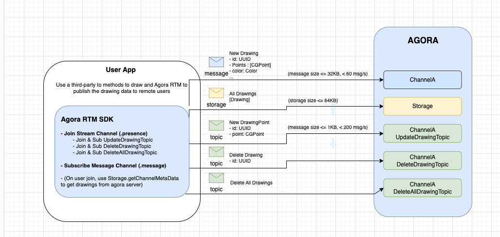

<a name="readme-top"></a>


### Architecture




<p align="right">(<a href="#readme-top">back to top</a>)</p>


<!-- USAGE EXAMPLES -->
## Usage

This sample showcases how you can build an whiteboard collaborative tool. For the whiteboard, this sample uses SwiftUI's native method to draw. To transfer the whiteboard data, this sample uses both the `message` and `stream` channel types. These 2 types are used to publish different types data. 

- The `message` channelType have a max message size of 32KB and rate of <60 messages per second. This is used to publish new Drawing which can be larger 1KB
- The`stream` channelType have a max message size of 1KB, but has a rate of <200 messages per second. This is used to publish new Drawing Point in real-time, which can exceed the 60 message per second. 

 

| Subscribe features | Description |
| --- | --- |
| (stream topics) | Callback to receive new whiteboard points and delete drawing(s) event. |
| `.message` | Callback to receive new drawings  |
| `.presence` | Callback to get the users states (e.g join/leave/userstates) of a channel |

This sample also uses RTM Storage feature to store and fetch the drawings. There is no need to subscribe `.storage` callback. See below for details. 

<!-- Sample Code -->
## Sample Code

**Initialize the Agora RTM SDK**
```swift
// Initialize the Agora RTM SDK
let config = AgoraRtmClientConfig(appId: "your_app_id" , userId: "user_id")
var agoraRtmKit: AgoraRtmClientKit = try AgoraRtmClientKit(config, delegate: self)
```

**Login to Agora Server**
```swift
// Login to Agora Server
if let (response, error) = await agoraRtmKit?.login("user_token") {
    if error == nil{
       // Login successful
    }else{
      // Login failed
    }
} else {
    // Login failed
}
```

**Subscribe to a Channel (To Receive New Drawing)**
```swift
// Define the subscription feature
let subOptions: AgoraRtmSubscribeOptions = AgoraRtmSubscribeOptions()
subOptions.features =  [.message]

// Subscribe to a channel  
if let (response, error) = await agoraRtmKit?.subscribe(channelName: channelName, option: subOptions){
    if error == nil{
       // Subscribe successful
    }else{
      // Subscribe failed
    }
}
```

**Join and Subscribe to Topics**
```swift
  // Set publishing options
let publishTopicOptions = AgoraRtmJoinTopicOption()
publishTopicOptions.priority = .high
publishTopicOptions.qos = .ordered

// Join and subcribe to 3 topics for different whiteboard events
for topic in [UpdateDrawingTopic, DeleteDrawingTopic, DeleteAllDrawingTopic] {
    // Join topic to publish
    if let (response, error) = await agoraStreamChannel?.joinTopic(topic, option: publishTopicOptions) {
        if error == nil {
            // Join success
        }else {
            // Join failed
        }
    }

    // Subscribe to topic
    if let (response, error) = await agoraStreamChannel?.subscribeTopic(topic, option: subscribeTopicOptions) {
        if error == nil {
            // Subscribe success
        }else {
            // Subscribe failed
        }
    }
}

```
**Publish new drawing, drawing points, and delete drawing event**
```swift
// Publish new Drawing
if let (response, error) = await agoraRtmKit?.publish(channelName: mainChannel, message: newDrawingString, option: pubOptions) {...}

// Publish new Drawing point
if let (response, error) = await agoraStreamChannel?.publishTopicMessage(topic: UpdateDrawingTopic, message: newDrawingPoint, option: nil) {...}

// Publish delete Drawing event
if let (response, error) = await agoraStreamChannel?.publishTopicMessage(topic: DeleteDrawingTopic, message: drawingID.uuidString, option: nil) {...}

```


**Storage methods to save, fetch, and delete drawings in the RTM Cloud Storage**
```swift
// Save the drawings to the cloud (NOTE: There is a 64KB storage limit for the channel metadata)
let metaDataItem: AgoraRtmMetadataItem = AgoraRtmMetadataItem()
metaDataItem.key = "StorageDrawingKey"
metaDataItem.value = drawingsString
metaData.setMetadataItem(metaDataItem)

if let (response, error) = await agoraRtmKit?.getStorage()?.setChannelMetadata(channelName: mainChannel, channelType: .message, data: metaData, options: AgoraRtmMetadataOptions(), lock: nil) {...}

// Fetch the drawings to the cloud (e.g. use this when the user first logins)
if let (response, error) = await agoraRtmKit?.getStorage()?.getChannelMetadata(channelName: mainChannel, channelType: .message) {...}

// Delete the drawings from the cloud
if let (response, error) = await agoraRtmKit?.getStorage()?.removeChannelMetadata(channelName: mainChannel, channelType: .message, data: metaData, options: nil, lock: nil) {...}


```


**Logout RTM**
```swift
// Logout RTM server
func logoutRTM(){
    agoraRtmKit?.logout()
    agoraRtmKit?.destroy()
}
```

**Setup RTM Callbacks**
```swift
// Receive message event notifications in subscribed message channels and subscribed topics.
func rtmKit(_ rtmKit: AgoraRtmClientKit, didReceiveMessageEvent event: AgoraRtmMessageEvent) {
    
    switch event.channelType {
    case .message:
        // Received new drawing,
        if let jsonString = event.message.stringData, let newDrawing = convertJsonStringToObject(jsonString: jsonString, objectType: Drawing.self) {
            print("Bac's didReceiveMessageEvent new drawing is \(jsonString)")
            drawings.append(newDrawing)
        }
        break
    case .stream:
        switch event.channelTopic {

        case UpdateDrawingTopic:
            if let jsonString = event.message.stringData, let newDrawingPoint = convertJsonStringToObject(jsonString: jsonString, objectType: DrawingPoint.self) {
                print("Update new point to drawing")
                if let index = drawings.firstIndex(where: {$0.id == newDrawingPoint.id}) {
                    drawings[index].points.append(newDrawingPoint.point)
                }
            }
            break
        case DeleteDrawingTopic:
            if let convertedUUID = UUID(uuidString: event.message.stringData ?? "") {
                if let index = drawings.firstIndex(where: {$0.id == convertedUUID}) {
                    print("Delete the drawing with uid convertedUUID")
                    drawings.remove(at: index)
                }
            }
            break
            
        case DeleteAllDrawingTopic:
            print("Delete all drawings")
            Task {
                await MainActor.run {
                    drawings.removeAll()
                }
            }
            break;
        default:
            break
        }
        break
    case .user:
        
        
        break
    case .none:
        break
    @unknown default:
    }
}

// Receive presence event notifications in subscribed message channels and joined stream channels.
func rtmKit(_ rtmKit: AgoraRtmClientKit, didReceivePresenceEvent event: AgoraRtmPresenceEvent) {    
    if event.type == .remoteLeaveChannel || event.type == .remoteConnectionTimeout {
        
        // Remove user from list
        if let userIndex = users.firstIndex(where: {$0.userId == event.publisher}) {
            users.remove(at: userIndex)
        }
    }else if event.type == .remoteJoinChannel && event.publisher != nil {
        
        // Add user to list if it doesn't exist
        if !users.contains(where: {$0.userId == event.publisher}) && event.publisher != nil {
            let userState = AgoraRtmUserState()
            userState.userId = event.publisher!
            userState.states = event.states
            users.append(userState)
        }
        
        // StreamChannel - Resubscribe for new users
        Task {
            await reSubscribeNewUsers()
        }
    }

}


```


<!-- NOTE-->
## NOTE

- You can technically just use `message` channelType to send and publish new Drawing data. Just make sure it doesn't reach the 60 messages/second threshold. 
- Joining a stream channel requires you to use an RTC token (in addition to the RTM token you used to login to RTM server)
- For Stream Channel, the SDK does NOT autosubscribe new users if you didn't pre-subcribe to them before. For e.g. If a new user joins a topic and publishes to a message, you will NOT receive the message. If a new user joins, you have to subscribe to this user first.
- (Alternatively) if you know the list of publishers before they join, you can pre-sub to these users. Once they join, the SDK will automatically subscribe to them. e.g.
- The RTM Storage Channel metadata has a limit of 64KB. If the drawings reached more than 64KB, it will fail to store. Alternatively, you could use a third-party cloud storage to store the drawings


<p align="right">(<a href="#readme-top">back to top</a>)</p>


<!-- RTM API Limitation -->
## References

- API Reference (https://docs.agora.io/en/signaling/reference/api?platform=ios)
- Pricing (https://docs.agora.io/en/signaling/overview/pricing?platform=ios)
- API Limitations (https://docs.agora.io/en/signaling/reference/limitations?platform=android)
- Security/Compliance (https://docs.agora.io/en/signaling/reference/security?platform=android) 


<p align="right">(<a href="#readme-top">back to top</a>)</p>


<!-- LICENSE -->
## License

Distributed under the MIT License. See `LICENSE.txt` for more information.

<p align="right">(<a href="#readme-top">back to top</a>)</p>


<!-- CONTACT -->
## Contact

Bac Huang  - bac@boldbright.studio

Project Link: [https://github.com/Bac1314/APIExample_AgoraRTM2x](https://github.com/Bac1314/APIExample_AgoraRTM2x)

<p align="right">(<a href="#readme-top">back to top</a>)</p>


