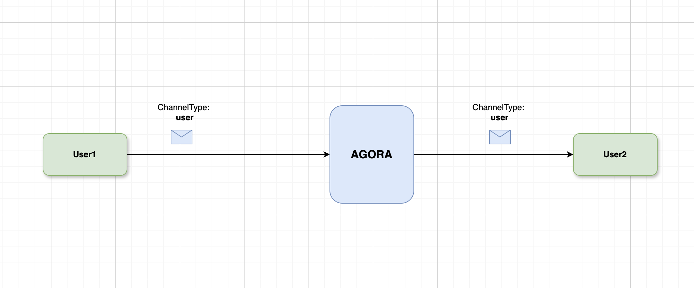

<a name="readme-top"></a>


### Architecture




<p align="right">(<a href="#readme-top">back to top</a>)</p>


<!-- USAGE EXAMPLES -->
## Usage

This sample showcases peer-to-peer messaging in Agora RTM SDK. There is no need to subscribe to a particular channel before receiving messages. The user can directly publish the message to another user. 

| Subscribe features | Description |
| --- | --- |
| `.user` | Callback to receive messages from users directly |


<!-- Sample Code -->
## Sample Code

**Initialize the Agora RTM SDK**
```swift
// Initialize the Agora RTM SDK
let config = AgoraRtmClientConfig(appId: "your_app_id" , userId: "user_id")
var agoraRtmKit: AgoraRtmClientKit = try AgoraRtmClientKit(config, delegate: self)
```

**Login to Agora Server**
```swift
// Login to Agora Server
if let (response, error) = await agoraRtmKit?.login("user_token") {
    if error == nil{
       // Login successful
    }else{
      // Login failed
    }
} else {
    // Login failed
}
```

**Subscribe to a Channel**
```swift
// Define the subscription feature
let subOptions: AgoraRtmSubscribeOptions = AgoraRtmSubscribeOptions()
subOptions.features =  [.message, .presence]

// Subscribe to a channel  
if let (response, error) = await agoraRtmKit?.subscribe(channelName: channelName, option: subOptions){
    if error == nil{
       // Subscribe successful
    }else{
      // Subscribe failed
    }
}
```

**Publish to a User**
```swift
// Define the publish options
let pubOptions = AgoraRtmPublishOptions()
pubOptions.channelType = .user

// Publish message to a user
if let (response, error) = await agoraRtmKit?.publish(channelName: "remoteUserName", message: messageString, option: pubOptions){
    if error == nil {
        // Publish successful
    }else{
        // Publish failed
    }
    
}
```

**Logout RTM**
```swift
// Logout RTM server
func logoutRTM(){
    agoraRtmKit?.logout()
    agoraRtmKit?.destroy()
}
```

**Setup RTM Callbacks**
```swift
// Receive 'message' event notifications in subscribed message channels and subscribed topics.
func rtmKit(_ rtmKit: AgoraRtmClientKit, didReceiveMessageEvent event: AgoraRtmMessageEvent) {
    switch event.channelType {
    case .message:
        break
    case .stream:
        break
    case .user:
        print("Received msg = \(event.message.stringData ?? "Empty") from \(event.publisher)")
        break
    case .none:
        break
    @unknown default:
    }
}

```


<!-- RTM API Limitation -->
## References

- API Reference (https://docs.agora.io/en/signaling/reference/api?platform=ios)
- Pricing (https://docs.agora.io/en/signaling/overview/pricing?platform=ios)
- API Limitations (https://docs.agora.io/en/signaling/reference/limitations?platform=android)


<p align="right">(<a href="#readme-top">back to top</a>)</p>


<!-- LICENSE -->
## License

Distributed under the MIT License. See `LICENSE.txt` for more information.

<p align="right">(<a href="#readme-top">back to top</a>)</p>


<!-- CONTACT -->
## Contact

Bac Huang  - bac@boldbright.studio

Project Link: [https://github.com/Bac1314/APIExample_RTM2x](https://github.com/Bac1314/APIExample_RTM2x)

<p align="right">(<a href="#readme-top">back to top</a>)</p>


