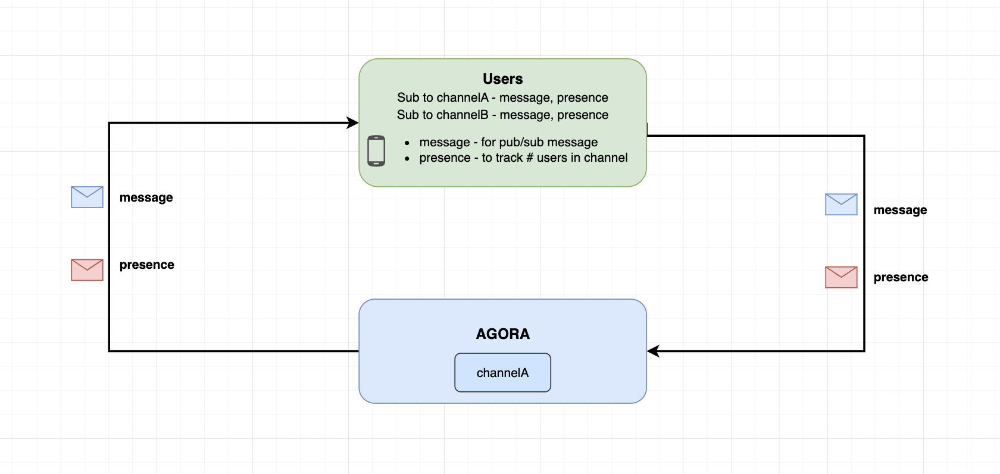

<a name="readme-top"></a>


### Architecture




<p align="right">(<a href="#readme-top">back to top</a>)</p>


<!-- USAGE EXAMPLES -->
## Usage

This sample demonstrates the implementation of Agora RTM stream channels, which offer higher message transmission rates and greater message concurrency capabilities compared to message channels. In order to publish messages in a stream channel, users must first join a topic. However, it is important to note that each message in a stream channel is limited to 1KB in size, unlike message channels which allow messages of up to 32KB.

| Subscribe features | Description |
| --- | --- |
| `.stream` | Callback to receive topic messages |
| `.presence` | Callback to get the users states (e.g join/leave/userstates) of a channel |


<!-- Sample Code -->
## Sample Code

**Initialize the Agora RTM SDK**
```swift
// Initialize the Agora RTM SDK
let config = AgoraRtmClientConfig(appId: "your_app_id" , userId: "user_id")
var agoraRtmKit: AgoraRtmClientKit = try AgoraRtmClientKit(config, delegate: self)
```

**Login to Agora Server**
```swift
// Login to Agora Server
if let (response, error) = await agoraRtmKit?.login("user_token") {
    if error == nil{
       // Login successful
    }else{
      // Login failed
    }
} else {
    // Login failed
}
```

**Join a Stream Channel**
```swift
// Create a stream channel 
var agoraStreamChannel: AgoraRtmStreamChannel = try agoraRtmKit?.createStreamChannel("streamChannelname") 

// Setup join options
// Note: The token property must used a RTC token instead of RTM token
let joinOption = AgoraRtmJoinChannelOption()
joinOption.features = [.presence]
joinOption.token = tokenRTC // RTC token

if let (response, error) = await agoraStreamChannel?.join(joinOption) {
    if error == nil {
        // Join successful
    }else {
        // Join failed
    }
}
            
```

**Join a Topic (to publish messages)**
```swift
  // Set publishing options
let publishTopicOptions = AgoraRtmJoinTopicOption()
publishTopicOptions.priority = .high
publishTopicOptions.qos = .ordered

// Join topic
if let (response, error) = await agoraStreamChannel?.joinTopic("topicname", option: publishTopicOptions) {
    if error == nil {
        // Join success
    }else {
        // Join failed
    }
}
```

**Subscribe a Topic (to receive messages)**
```swift
// Set subscribing options
// Note: If a new user joins later, you'll have redefine this 
let subscribeTopicOptions = AgoraRtmTopicOption()
subscribeTopicOptions.users = ["remoteUserID1", "remoteUserID2"] // If you do not set this property, the system will randomly subscribe to 64 users by default


// Subscribe to topic
if let (response, error) = await agoraStreamChannel?.subscribeTopic(topic, option: subscribeTopicOptions) {
    if error == nil {
        // Subscribe success
        print("Bac's subscribed Success users \(String(describing: response?.succeedUsers)) AND Failed \(String(describing: response?.failedUsers)) ")

    }else {
        // Subscribe failed
    }
}
```

**Logout RTM**
```swift
// Logout RTM server
func logoutRTM(){
    agoraRtmKit?.logout()
    agoraRtmKit?.destroy()
}
```


**Logout RTM**
```swift
// Logout RTM server
func logoutRTM(){
    agoraRtmKit?.logout()
    agoraRtmKit?.destroy()
}
```


**Setup RTM Callbacks**
```swift
// Receive 'message' event notifications in subscribed message channels and subscribed topics.
func rtmKit(_ rtmKit: AgoraRtmClientKit, didReceiveMessageEvent event: AgoraRtmMessageEvent) {
    switch event.channelType {
    case .message:
        break
    case .stream:
        print("Received stream topic \(event.channelTopic) and message \(event.message.stringData ?? "")")
        break
    case .user:
        break
    case .none:
        break
    @unknown default:
    }
}

// Receive 'presence' event notifications in subscribed message channels and joined stream channels.
func rtmKit(_ rtmKit: AgoraRtmClientKit, didReceivePresenceEvent event: AgoraRtmPresenceEvent) {

    if event.type == .remoteLeaveChannel || event.type == .remoteConnectionTimeout {
    // A remote user left the channel
        
    }else if event.type == .remoteJoinChannel && event.publisher != nil {
     // A remote user subscribe the channel
     // NOTE: You must manually subscribe to this new user
    let subscribeTopicOptions = AgoraRtmTopicOption()
    subscribeTopicOptions.users = ["remoteUserID1", "remoteUserID2", event.publisher] // Add new user to list OR leave it empty


    // Subscribe to topic
    if let (response, error) = await agoraStreamChannel?.subscribeTopic(topic, option: subscribeTopicOptions)
        
    }else if event.type == .snapshot {
    // Get a snapshot of all the subscribed users' including 'presence' data (aka temporary key-value pairs storage)
        
    }else if event.type == .remoteStateChanged {
    // A remote user's 'presence' data was changed
    }
}
```


<!-- RTM API Limitation -->
## NOTE

- Message packet size between Stream Channel Topic and Message Channel is 1KB and 64KB respectively.
- The SDK does NOT autosubscribe new users if you didn't pre-subcribe to them before. For e.g. If a new user joins a topic and publishes to a message, you will NOT receive the message. If a new user joins, you have to subscribe to this user first.
- (Alternatively) if you know the list of publishers before they join, you can pre-sub to these users. Once they join, the SDK will automatically subscribe to them. e.g.
    

```swift
// Pre-sub the users before they join
let subscribeTopicOptions = AgoraRtmTopicOption()
subscribeTopicOptions.users = ["FutureUserID1", "FutureUserID2"]


// Subscribe to topic
if let (response, error) = await agoraStreamChannel?.subscribeTopic(topic, option: subscribeTopicOptions)
```


<p align="right">(<a href="#readme-top">back to top</a>)</p>


<!-- RTM API Limitation -->
## References

- API Reference (https://docs.agora.io/en/signaling/reference/api?platform=ios)
- Pricing (https://docs.agora.io/en/signaling/overview/pricing?platform=ios)
- API Limitations (https://docs.agora.io/en/signaling/reference/limitations?platform=android)


<p align="right">(<a href="#readme-top">back to top</a>)</p>


<!-- LICENSE -->
## License

Distributed under the MIT License. See `LICENSE.txt` for more information.

<p align="right">(<a href="#readme-top">back to top</a>)</p>


<!-- CONTACT -->
## Contact

Bac Huang  - bac@boldbright.studio

Project Link: [https://github.com/Bac1314/APIExample_AgoraRTM2x](https://github.com/Bac1314/APIExample_AgoraRTM2x)

<p align="right">(<a href="#readme-top">back to top</a>)</p>


